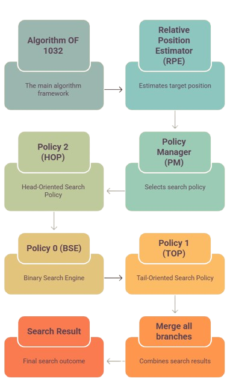

<div align="center">

# Algorithm OF 1032

### An Adaptive Multi-Policy Search Framework for Efficient Searching in Sorted Arrays

A research-oriented adaptive searching framework that dynamically selects specialized search policies based on the estimated position of the target element.

---


</div>

---

# Overview

Algorithm OF 1032 is an adaptive multi-policy searching framework developed through six iterative research versions.

Unlike traditional searching algorithms that rely on a single search strategy, Algorithm OF 1032 first predicts the approximate location of the target element and dynamically selects the most suitable search policy.

The framework is composed of:

- Relative Position Estimator (RPE)
- Policy Manager (PM)
- Binary Search Engine (BSE)
- Head-Oriented Search Policy (HOP)
- Tail-Oriented Search Policy (TOP)

---

# Framework Architecture

<p align="center">



</p>

---

# Framework Components

| Component | Responsibility |
|------------|---------------|
| Relative Position Estimator (RPE) | Estimates normalized target position |
| Policy Manager (PM) | Selects the appropriate search policy |
| Binary Search Engine (BSE) | Handles middle-region searches |
| Head-Oriented Search Policy (HOP) | Optimized for targets near the beginning |
| Tail-Oriented Search Policy (TOP) | Optimized for targets near the end |

---

# Key Features

- Adaptive multi-policy architecture
- Dynamic search policy selection
- Relative position estimation
- Modular framework design
- Configurable threshold values
- Experimental benchmarking
- Complexity analysis
- IEEE-style research paper
- Open-source implementation

---

# Repository Structure

```text
Algorithm OF 1032
│
├── Benchmarks/
│   └── Benchmark.cpp
│
├── Data/
│   ├── Analysis_V3.xlsx
│   ├── ComparisonData.cpp
│   ├── ComparisonData.xlsx
│   ├── TestData.cpp
│   └── TestData.xlsx
│
├── Docs/
│   ├── CHANGELOG.md
│   ├── Complexity.md
│   └── Rejected.md
│
├── Papers/
│   └── Research paper of Algorithm of 1032.docx
│
├── Source Code/
│   ├── V1.cpp
│   ├── V2.cpp
│   ├── V3/
│   ├── V4.cpp
│   ├── V5.cpp
│   └── V6.cpp
│
├── Visuals/
│   ├── Figure_1_Framework_Architecture.png
│   ├── Figure_2_Policy_Selection.png
│   ├── Figure_3_Evolution_Of_Versions.png
│   ├── Figure_4_Binary_Vs_AO32.png
│   ├── Figure_5_Policy_Split.png
│   ├── Figure_6_Complete_Workflow.png
│   └── Adaptive_Search_Policy.png
│
├── LICENSE
└── README.md
```

---

# How It Works

```text
Input Target
      │
      ▼
Relative Position Estimator
      │
      ▼
Policy Manager
      │
 ┌────┼────┐
 ▼    ▼    ▼
HOP  BSE  TOP
      │
      ▼
 Search Result
```

---

# Complexity Analysis

| Component | Time | Space |
|-----------|------|-------|
| Relative Position Estimator | O(1) | O(1) |
| Policy Manager | O(1) | O(1) |
| Binary Search Engine | O(log n) | O(1) |
| Head-Oriented Search Policy | O(√n) | O(1) |
| Tail-Oriented Search Policy | Experimental Analysis | O(1) |
| Overall Framework | O(1) + T<sub>SelectedPolicy</sub>(n) | O(1) |

A complete derivation is available in **Docs/Complexity.md**.

---

# Experimental Evaluation

The framework was evaluated using sorted integer datasets of multiple sizes.

Evaluation metrics include:

- Correctness
- Iterations
- Comparisons
- Policy Selection
- Estimated Position

The benchmark achieved **100% correctness** across all conducted experiments.

---

# Version History

| Version | Description |
|----------|-------------|
| V1 | Initial Jump Search Improvements |
| V2 | Hybrid Jump + Binary Search |
| V3 | Adaptive Search Policies |
| V4 | Policy Manager |
| V5 | Relative Position Estimator |
| **V6** | Final Adaptive Multi-Policy Framework |

Detailed development history is available in **Docs/CHANGELOG.md**.

---

# Research Paper

The complete IEEE-style research paper is available in the **Papers** directory.

The paper includes:

- Introduction
- Related Work
- Proposed Framework
- Complexity Analysis
- Experimental Evaluation
- Results and Discussion
- Future Work
- Conclusion

---

# Installation

Clone the repository

```bash
git clone https://github.com/NayanSadariya/Algorithm-of-1032.git
```

Move into the project

```bash
cd Algorithm-of-1032
```

Compile

```bash
g++ "Source Code/V6.cpp" -o algorithm
```

Run

```bash
./algorithm
```

---

# Citation

If you use this work in your research, please cite:

```text
Nayan Sadariya.

Algorithm OF 1032: An Adaptive Multi-Policy Search Framework
for Efficient Searching in Sorted Arrays.

GitHub Repository, 2026.
```

---

# Future Work

- Formal proof of Tail-Oriented Search Policy
- Adaptive threshold optimization
- Machine learning-assisted policy selection
- Additional search policies
- Large-scale benchmarking
- Parallel implementation

---

# License

This project is released under the **MIT License**.

See the **LICENSE** file for details.

---

# Author

<div align="center">

## Nayan Sadariya

Computer Science Engineering Student

Algorithms • Data Structures • Artificial Intelligence • Software Engineering

GitHub

https://github.com/NayanSadariya

LinkedIn

https://www.linkedin.com/in/nayan-sadariya/

---

### Algorithm OF 1032

**Version 6 — Final Research Implementation**

© 2026 Nayan Sadariya

</div>
